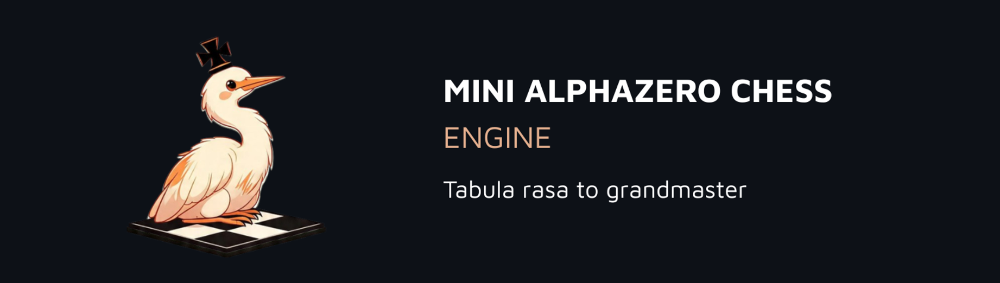

# Mini-AlphaZero-Chess

<p align="center">
  
  
  
  
</p>

A compact, high-performance **AlphaZero-like chess engine** that combines **Monte Carlo Tree Search (MCTS)** with a **Policy-Value Neural Network** for guided rollouts. This project replaces classical random playouts with learned policy and value predictions, offering a self-reinforcing reinforcement learning cycle.

It features a **premium web-based GUI dashboard** that displays real-time MCTS statistics, AI evaluation, captured piece arrays, and interactive gameplay configs.

<p align="center">
  
</p>


---

## 🌟 Key Features

- **Neural-Guided Search**: Implements a PyTorch Policy-Value Network predicting move probabilities (policy) and board value evaluation.
- **Monte Carlo Tree Search (MCTS)**: Employs Upper Confidence Bounds for Trees (PUCT) guided by network priors, featuring Dirichlet noise for self-play exploration.
- **Self-Play Loop**: Continuous data collection through MCTS-guided self-play, stored in a compressed Replay Buffer.
- **Premium Web Dashboard**: A dark-glassmorphic front-end GUI featuring:
  - **Real-time Eval Bar**: Visual slider displaying current position evaluations.
  - **AI Thought Stream**: Renders the top candidate moves considered by MCTS with visit count and probability percentages.
  - **Side Toggling**: Play as White or Black (with board auto-orientation).
  - **Smart Captured Piles**: Dynamic board scanning to show captured piece piles.
- **Data Bootstrapping**: A multi-processing PGN parsing tool powered by Stockfish for bootstrapping network parameters.

---

## 📁 Repository Structure

```text
mini-alphazero-chess/
├── checkpoints/             # Saved model weights (.pth)
│   ├── best.pth             # Current best performing stable model
│   └── candidate.pth        # Training candidate model
├── Dataset/                 # Replay buffer data (.pkl.gz)
│   ├── stockfish_dataset.pkl.gz
│   └── stockfish_dataset_gen0.pkl.gz
├── logs/                    # Training and matchmaking logs
├── src/                     # Core source code
│   ├── evaluation/          # Candidate model matchmaking/evaluation logic
│   ├── game/                # Chess environment wrapper (python-chess integration)
│   ├── gui/                 # Web dashboard interface (chessboard.js + CSS)
│   ├── mcts/                # MCTS search tree and action indexer
│   ├── network/             # PyTorch Neural Network architecture (ResNet backbone)
│   ├── selfplay/            # Self-play game generation workers
│   ├── server/              # FastAPI backend server
│   ├── training/            # PyTorch network trainer and loss calculation
│   └── utils/               # Common helper utilities and replay buffer
├── Testing/                 # Unit and integration test suites
├── generate_data.py         # Stockfish PGN bootstrapping tool (Multi-processing)
├── requirements.txt         # Project python package dependencies
└── README.md                # Project documentation
```

---

## 🚀 Getting Started

### 1. Installation
Clone the repository and install the dependencies:
```bash
pip install -r requirements.txt
```

### 2. Running the Web GUI Game
To play against the bot, launch the API server and open the web dashboard.

**Start the FastAPI backend server**:
```bash
python -m uvicorn src.server.api:app --host 127.0.0.1 --port 8000
```

**Open the game interface**:
Open [src/gui/index.html](src/gui/index.html) directly in any web browser. You can select your side (White or Black), adjust difficulty/logic, and analyze the AI's search process in real-time.

---

## 🧠 Architecture Overview

### 1. Neural Network (`src/network/model.py`)
Built in PyTorch, the network takes an encoded board state of size `(18, 8, 8)` (representing pieces, active player, castling rights, en passant, and half-move clock) and outputs:
- **Policy Head**: Raw logits over the 4672-dimensional chess action space (all geometrically possible moves).
- **Value Head**: A scalar value in `[-1.0, 1.0]` representing the expected game outcome from the current player's perspective.

### 2. Monte Carlo Tree Search (`src/mcts/mcts.py`)
Instead of standard random rollouts, the search tree uses the Policy-Value network to evaluate leaf positions:
- **Selection**: Traverses the tree choosing actions that maximize the PUCT formula:
  $$U(s,a) = Q(s,a) + c_{puct} P(s,a) \frac{\sqrt{\sum_b N(s,b)}}{1 + N(s,a)}$$
- **Expansion**: Leverages network policy predictions as priors ($P(s,a)$) for unexplored children.
- **Evaluation**: Scores leaf nodes using the network's value head prediction ($V(s)$).
- **Backpropagation**: Alternates value signs recursively up the path back to the root node.

### 3. Self-Play & Training Loop (`src/main.py`)
1. **Self-Play**: Multiple processes run in parallel, playing matches against themselves using the current best model.
2. **Replay Buffer**: States, MCTS search visit probabilities, and game outcomes are archived in a circular queue.
3. **Optimizing**: Training updates model weights by minimizing a combined Loss:
   $$L = (z - V)^2 - \pi^T \log P + \lambda ||\theta||^2$$
4. **Matchmaking**: Candidate models are benchmarked against the current best. If the candidate achieves a win rate $> 55\%$, it is promoted to the new best.

---

## 📊 Dataset Bootstrapping (Optional)

You can bootstrap the neural network policy/value heads using high-quality human PGN games analyzed by Stockfish.

To generate a starting dataset using multi-processing Stockfish workers:
```bash
python generate_data.py --pgn_path "path_to_pgn_file.pgn" --num_games 1000 --output_path "Dataset/stockfish_dataset.pkl.gz"
```
*(Make sure to download the Stockfish executable and update `--stockfish_path` accordingly).*

---

## 🛠️ Verification Tests
Verify engine calculations and ChessGame state integrity:
```bash
python Testing/engine_test.py
```
This runs checkmate terminal assessments, stalemate draw fallbacks, and MCTS probability calculations.

---

## 📚 References
- **AlphaZero**: Silver, D. et al. (2017) — *“Mastering Chess and Shogi by Self-Play with a General Reinforcement Learning Algorithm.”* [arXiv:1712.01815](https://arxiv.org/abs/1712.01815)
- **Leela Chess Zero (Lc0)**: Open-source reinforcement learning chess engine ([lczero.org](https://lczero.org))
